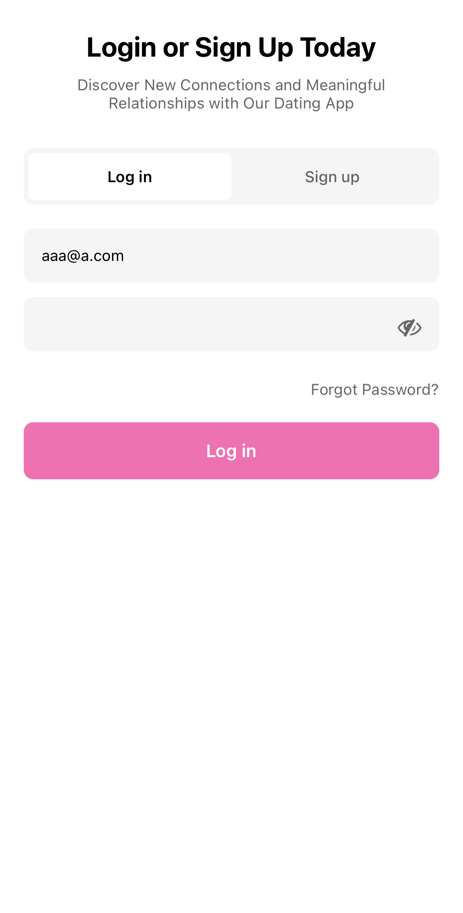
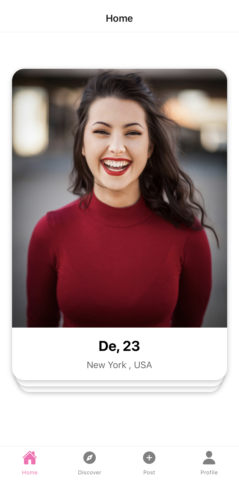
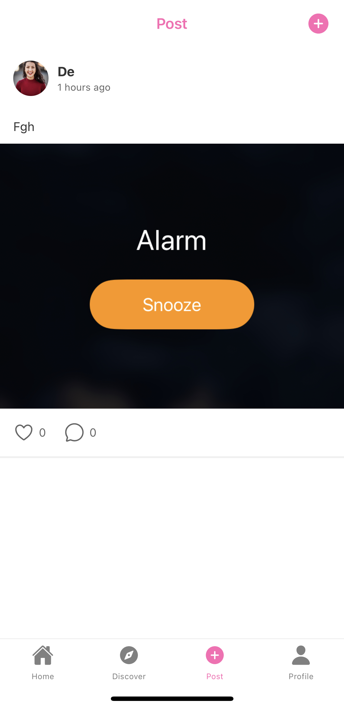
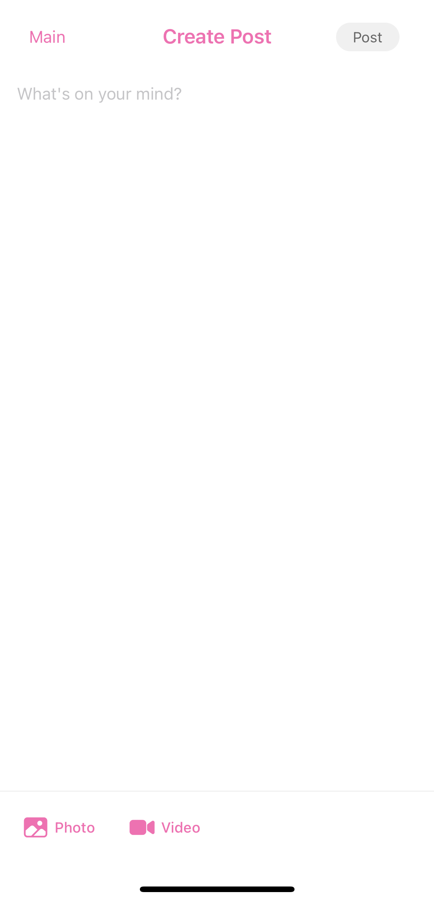
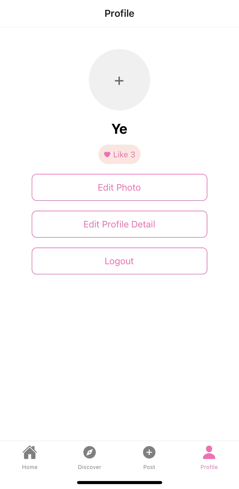
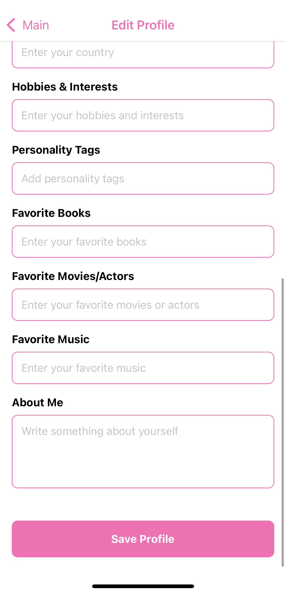

# CS 5520 Final Project: Spark 💫

## Project Description 
Spark is a relationship app designed for meaningful connections beyond swipes. Using AI-powered matchmaking and an interactive map, it helps users discover people nearby and find connections aligned with their values. Share moments on your social feed and engage authentically with privacy and control.

## Demo 🎬
to be added

## App Functionality ✨
- **AI-powered matchmaking:** Users can use AI to find matches based on their preferences and values.
- **Interactive map:** Users can see the map of their matches on the app, and filter matches by location and interests.
- **Social Post:** Users can share their moments on the app, and engage with others' moments.
- **Profile:** Users can customize their profile, and see others' profiles.
- **Notification:** Users will receive notifications on special occasions, such as Valentine’s Day and Christmas, prompting them to send messages to their matches.
 
## Database: Firebase Collections 📊
### Firestore Collections
- **Users:** Stores user profile information, including name, photo, bio, and interests.
   - **Fields:**
     - `userId`: unique identifier for each user.
     - `username`: user's name.
     - `email`: user's email.
     - `profilePhoto`: user's profile photo URL.
     - `photowall`: Array of user's photo wall, including multiple photos URL.
     - `pronouns`: user's pronouns.
     - `birthday`: user's birthday.
     - `occupation`: user's occupation.
     - `city`: user's city.
     - `hobbies&interests`: user's hobbies and interests.
     - `personalityTags`: Array of user's personality tags.
     - `favoriteBooks`: user's favorite books.
     - `favoriteMovies`: user's favorite movies.
     - `favoriteMusic`: user's favorite music.
     - `aboutMe`: user's introduction.
     - `likes`: Array of user's likes.
   - **CRUD Operations:**
     - **Create**: create a new user.
     - **Read**: read user profile.
     - **Update**: update user profile.
  
- **Posts:** Stores user posts information, including text, media (photo or video), timestamp, likes, and comments.
   - **Fields:**
     - `userId`: user's ID who posted the post.
     - `postId`: unique identifier for each post.
     - `content`: post's text.
     - `media`: Array of post's photo and video URL.
     - `createdAt`: post's creation time.
     - `likesCount`: post's likes count number.
     - `likedBy`: Array of user's ID who liked the post.
   - **CRUD Operations:**
     - **Create**: create a new post.
     - **Read**: read post information.
     - **Update**: increment post's likes count number.
     - **Delete**: delete post.
   - **Subcollections:**
     - **comments**: Array of comments on the post.
        - **Fields:**
          - `userId`: user's ID who commented the post.
          - `content`: comment's text.
          - `createdAt`: comment's creation time.
        - **CRUD Operations:**
          - `createComment`: create a new comment.
          - `readComment`: read comment information.
  

### Firestore Storage Structure
- **Posts Folder** Stores user posts information, including photos and videos.
    - **Structure:** posts/{postId}
    - **Description:** This folder contains all images or videos related to specific posts made by users.
    - **Usage:** When a user creates a post with photos or videos, these media files are uploaded to this folder, stored under a subfolder named with the post’s unique ID (postId). Each post’s media can then be accessed through the URLs generated by Firebase Storage
- **Profile Pictures Folder** Stores user profile pictures.
    - **Structure:** profilePhoto/{userId}
    - **Description:** Stores profile pictures for all users.
    - **Usage:** When a user uploads a profile picture, it is stored in this folder under a subfolder named with the user’s unique ID (userId). The URL of the profile picture can then be accessed through the URLs generated by Firebase Storage.
- **Photo Wall Folder** Stores user photo wall pictures.
    - **Structure:** photoWall/{userId}
    - **Description:** Stores photo wall pictures for all users.
    - **Usage:** When a user uploads a photo wall picture, it is stored in this folder under a subfolder named with the user’s unique ID (userId). The URL of the photo wall picture can then be accessed through the URLs generated by Firebase Storage.

## Contributions 👭
### Team Members:
- [Yundi Tao](https://github.com/yundii)
- [Yaoyi Wang](https://github.com/YaoyiW27)
### Contribution Statements:
- Yundi Tao: Set up Firebase, including Firestore database configuration and initial CRUD operation connections. Write profile related functions and pages, including profile page, edit profile page, and profile details display page, connect them to the database. write home page,  connect it to the database.
- Yaoyi Wang: Set up the initial project, created the initial project structure. Write sign up, login, and logout functions and pages, connect them to the database. Write Post related functions and pages, including post display page, create post page, connect them to the database. 
- To be done: Map related page, including filter function; Search function on home page; profile related pages and functions, including notification page and photo wall display;
If time allows, we will add chat pages and functions.

## Screenshots 

## Version Control and Collaboration
All team members have equal access to the project repository, created branches for different features, and can push their changes to the main branch after review. Each member is responsible for creating separate branches for individual features or bug fixes, following the GitHub Flow workflow. Regular commits and pulls are made to ensure that the main branch stays up-to-date and conflicts are minimized.

### Note on Contributions
If any contributions were not directly recorded in GitHub commits (e.g., discussions on project design, feature planning, or debugging sessions), these contributions are documented here along with the names of the responsible team members. This ensures that all work, including collaborative planning and problem-solving, is acknowledged.
