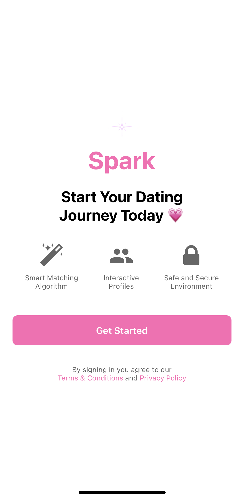
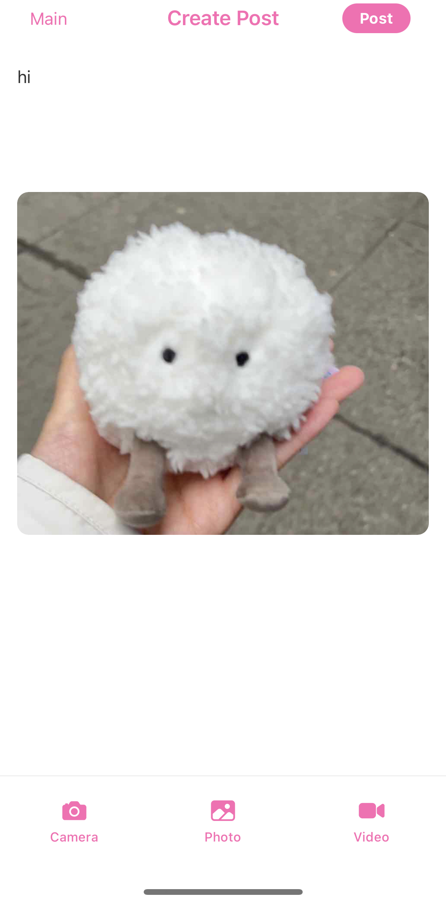
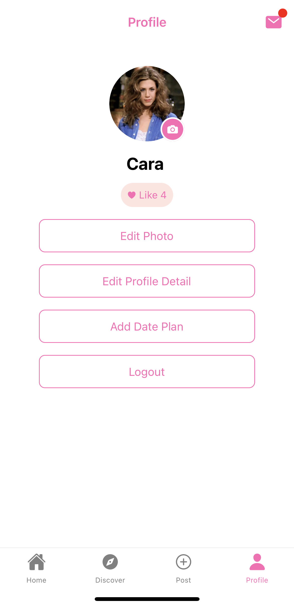
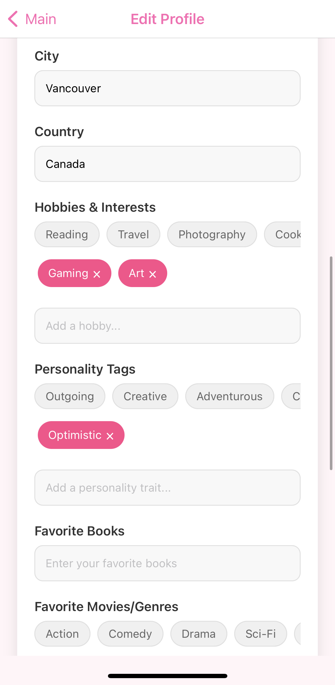
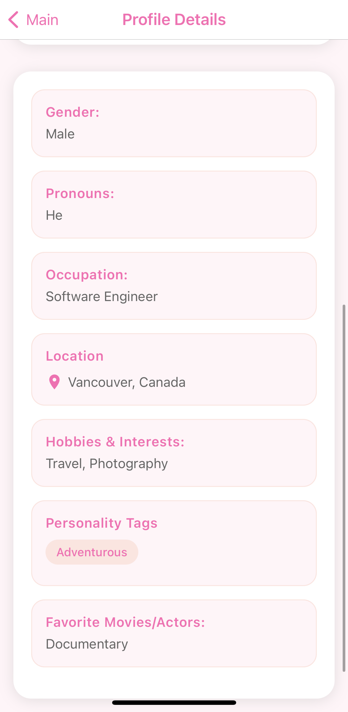
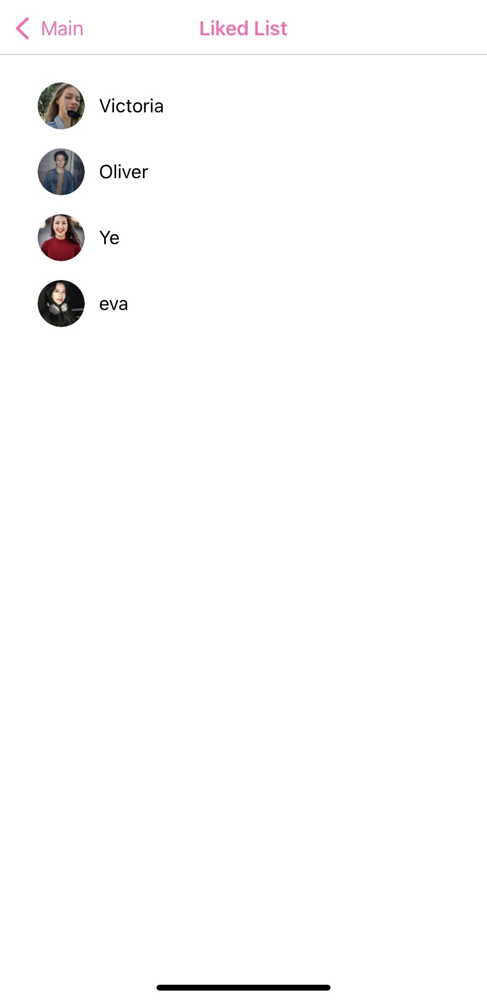
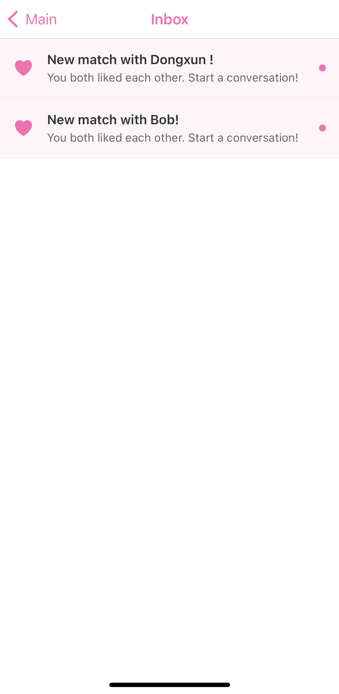

# CS 5520 Final Project: Spark 💫

[](https://forthebadge.com) &nbsp;
[](https://forthebadge.com) &nbsp;

## Tech Stack


## Project Description 
Spark is a relationship app designed for meaningful connections beyond swipes. Using an interactive map and interest-based matching, it helps users discover people nearby and find connections aligned with their values. Share moments on your social feed and engage authentically with privacy and control.

## Demo 🎬
[Demo Video](https://drive.google.com/file/d/17KZfLtHs3AjkDLzYYLUEQeNLemdE361D/view?usp=drive_link)


## App Functionality ✨
- **Interest-based matching:** Users can find matches based on their preferences, values, and shared interests.
- **Interactive map:** Users can see the map of their matches on the app, and filter matches by location and interests.
- **Social Post:** Users can share their moments on the app, and engage with others' moments.
- **Profile:** Users can customize their profile, and see others' profiles.
- **Plan Date and Reminder:** Users can plan dates with their matches, and set reminders for planned interactions.
## Database: Firebase Collections 📊
### Firestore Collections
- **Users:** Stores user profile information, including name, photo, bio, and interests.
   - **Fields:**
     - `userId`: unique identifier for each user.
     - `username`: user's name.
     - `email`: user's email.
     - `profilePhoto`: user's profile photo URL.
     - `photowall`: Array of user's photo wall, including multiple photos URL.
     - `age`: user's age.
     - `pronouns`: user's pronouns.
     - `gender`: user's gender.
     - `occupation`: user's occupation.
     - `city`: user's city.
     - `country`: user's country.
     - `hobbies&interests`: user's hobbies and interests.
     - `personalityTags`: Array of user's personality tags.
     - `favoriteBooks`: user's favorite books.
     - `favoriteMovies`: user's favorite movies.
     - `favoriteMusic`: user's favorite music.
     - `aboutMe`: user's introduction.
     - `likes`: Array of user's likes.
     - `likedBy`: Array of user's ID who liked the user.
   - **CRUD Operations:**
     - **Create**: create a new user.
     - **Read**: read user profile.
     - **Update**: update user profile.
  
- **Posts:** Stores user posts information, including text, media (photo or video), timestamp, likes, and comments.
   - **Fields:**
     - `userId`: user's ID who posted the post.
     - `postId`: unique identifier for each post.
     - `comments`: post's text.
     - `media`: Array of post's photo and video URL.
     - `createdAt`: post's creation time.
     - `likesCount`: post's likes count number.
     - `likedBy`: Array of user's ID who liked the post.
   - **CRUD Operations:**
     - **Create**: create a new post.
     - **Read**: read post information.
     - **Update**: increment post's likes count number.
     - **Delete**: delete post.
   - **Subcollections:**
     - **comments**: Array of comments on the post.
        - **Fields:**
          - `userId`: user's ID who commented the post.
          - `content`: comment's text.
          - `createdAt`: comment's creation time.
          - `userAvatar`: user's avatar.
          - `username`: commented user's name
        - **CRUD Operations:**
          - `createComment`: create a new comment.
          - `readComment`: read comment information.

- **Reminders:** Stores user notification reminders with customizable date plan.
   - **Fields:**
     - `userEmail`: email of the user who created the reminder.
     - `description`: custom reminder message.
     - `date`: scheduled date and time for the reminder.
     - `reminderStatus`: current status of the reminder.
     - `createdAt`: timestamp when the reminder was created.
     - `alertType`: type of the reminder.
     - `event`: details of the event.
     - `location`: location of the event.
     - `matchId`: ID of the match.
     - `matchName`: name of the match.
   - **CRUD Operations:**
     - **Create**: create a new date plan reminder.
     - **Read**: read reminder information.
     - **Update**: update reminder status or details.
     - **Delete**: delete reminder.

- **Matches:** Stores user matches information, including match's ID, name, isRead status.
   - **Fields:**
     - `users`: Array of user's ID who are matched.
     - `user1Name`: name of user 1.
     - `user2Name`: name of user 2.
     - `timestamp`: timestamp when the match was created.
     - `isRead`: mapping, including two boolean values representing whether user 1 and user 2 have read the match.
   - **CRUD Operations:**
     - **Create**: create a new match.
     - **Read**: read match information.
     - **Update**: update match's isRead status.
     - **Delete**: delete match when user unmatch.

- **DateInvitations:** Stores user date invitation information, including sender, receiver, date details.
   - **Fields:**
     - `senderEmail`: email of the sender.
     - `receiverEmail`: email of the receiver.
     - `createdAt`: timestamp when the invitation was created.
     - `date`: scheduled date and time for the invitation.
     - `location`: location of the invitation.
     - `event`: details of the event.
     - `senderName`: name of the sender.
   - **CRUD Operations:**
     - **Create**: create a new date invitation.
     - **Read**: read invitation information.
     - **Update**: update invitation read status.

### Firestore Storage Structure
- **Posts Folder** Stores user posts information, including photos and videos.
    - **Structure:** posts/{postId}
    - **Description:** This folder contains all images or videos related to specific posts made by users.
    - **Usage:** When a user creates a post with photos or videos, these media files are uploaded to this folder, stored under a subfolder named with the post’s unique ID (postId). Each post’s media can then be accessed through the URLs generated by Firebase Storage
- **Profile Pictures Folder** Stores user profile pictures.
    - **Structure:** profilePhoto/{userId}
    - **Description:** Stores profile pictures for all users.
    - **Usage:** When a user uploads a profile picture, it is stored in this folder under a subfolder named with the user’s unique ID (userId). The URL of the profile picture can then be accessed through the URLs generated by Firebase Storage.
- **Photo Wall Folder** Stores user photo wall pictures.
    - **Structure:** photoWall/{userId}
    - **Description:** Stores photo wall pictures for all users.
    - **Usage:** When a user uploads a photo wall picture, it is stored in this folder under a subfolder named with the user’s unique ID (userId). The URL of the photo wall picture can then be accessed through the URLs generated by Firebase Storage.


## Contributions 👭
### Team Members:
- [Yundi Tao](https://github.com/yundii)
- [Yaoyi Wang](https://github.com/YaoyiW27)
### Contribution Statements:
- Yundi Tao: Set up Firebase, including Firestore database configuration and initial CRUD operation connections. Write profile related functions and pages, including profile page, edit profile page, profile details display page, connect them to the database. write home page, including swipe screen and search screen. Write Reminder related functions and page, including date plan page, inbox page and date details page, connect them to the database.
- Yaoyi Wang: Set up the initial project, created the initial project structure. Write sign up, login, and logout functions and complete profile pages, connect them to the database. Write Post related functions and pages, including post display page, create post page, connect them to the database. Write map related functions and pages, including map display page, filter function, connect them to the database.
- To be done: chat pages and functions, styling of all pages, light and dark mode.

## Screenshots














## Firebase Rules
### Firestore Rules
```plaintext
rules_version = '2';
service cloud.firestore {
  match /databases/{database}/documents {
    match /Posts/{postId} {
      allow read: if true;
      allow write: if request.auth != null;
    }
    
    match /Users/{userId} {
      
      allow read: if true;
      
      
      allow update: if request.auth != null && (
        request.resource.data.diff(resource.data).affectedKeys().hasOnly(['likes']) ||
        request.resource.data.diff(resource.data).affectedKeys().hasOnly(['likedBy'])
      );
      
      
      allow write: if request.auth != null && request.auth.token.email == userId;
    }

    match /matches/{matchId} {
      allow read, write: if request.auth != null;
    }
    
    match /reminders/{reminder} {
    allow read, write: if request.auth != null;
 }
  
  match /dateInvitations/{invitation} {
    allow read: if request.auth != null && (
        resource.data.senderEmail == request.auth.token.email ||
        resource.data.receiverEmail == request.auth.token.email
    );
    
    allow create: if request.auth != null && 
        request.resource.data.senderEmail == request.auth.token.email;
        
    allow update: if request.auth != null && (
        resource.data.senderEmail == request.auth.token.email ||
        resource.data.receiverEmail == request.auth.token.email
    );
 }
  }
}
```
### Storage Rules
```plaintext
rules_version = '2';
service firebase.storage {
  match /b/{bucket}/o {
  	// Photo wall rules
  	match /photo_wall/{userEmail}/{fileName} {
      allow read: if true;
      allow write: if request.auth != null 
                  && request.auth.token.email == userEmail;
    }
    
    // Profile photos rules
    match /profile_photos/{userEmail}/{fileName} {
      allow read: if true;
      allow write: if request.auth != null;
    }
    
    // Posts rules
    match /posts/{userId}/{fileName} {
      allow read: if true;
      allow write: if request.auth != null;
    }
  }
}
```

### Firebase Indexes
The following indexes are configured in Firebase to optimize query performance:
```plaintext
- **matches collection:**
  - Compound index on `users` array (ASC), `timestamp` (DESC), `_name_` (DESC)
  
- **reminders collection:**  
  - Compound index on `userEmail` (ASC), `date` (DESC), `_name_` (DESC)
```

## Version Control and Collaboration
All team members have equal access to the project repository, created branches for different features, and can push their changes to the main branch after review. Each member is responsible for creating separate branches for individual features or bug fixes, following the GitHub Flow workflow. Regular commits and pulls are made to ensure that the main branch stays up-to-date and conflicts are minimized.

### Note on Contributions
If any contributions were not directly recorded in GitHub commits (e.g., discussions on project design, feature planning, or debugging sessions), these contributions are documented here along with the names of the responsible team members. This ensures that all work, including collaborative planning and problem-solving, is acknowledged.

### New Functionality Added in This Iteration

  1. **External API Integration**
    Implemented GeoJS API to fetch the user’s location automatically when the component mounts. This data is displayed and used within the app, shown in profile's city and country. (GeoJS API needs no key here.)
  2. **Mandatory User Profile Form**
    After registering a new account, users are required to complete a personal information form to proceed further in the application.
  3. **Forgot Password Flow Improvement**
	  Improved the “Forgot Password” feature for better usability, including enhanced UI/UX and secure password reset functionality.
  4. **LottieView Styling for Login Page**
	  Integrated Lottie animations to enhance the styling and interactivity of the login screen.
  5. **Profile Photo Wall Enhancement**
	  Redesigned the photo wall on the profile details page for a better user experience and visual appeal.
  6. **Mutual Like Inbox Feature**
	  when two users mutual like each other, a message is added to the inbox of both users. 
  7. **Date Invitation Inbox Feature**
	  when user receive a date invitation, a message is added to the inbox of the user, user can navigate to the date details page.
  8. **Date Plan Reminder Feature**
	  when users plan a date with match, they can set a customizable reminder for the date and time, and the notification will appear at the time which users set.